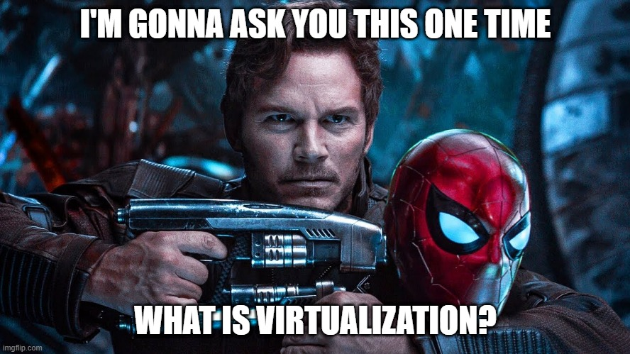
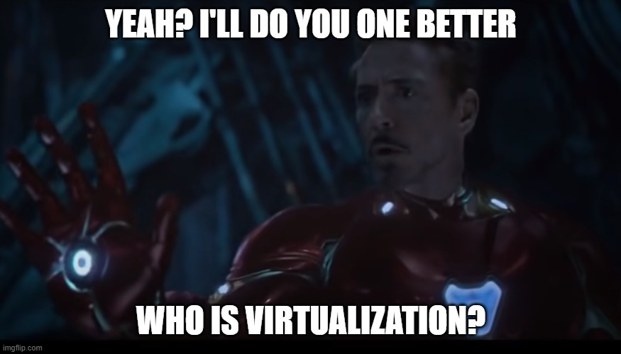
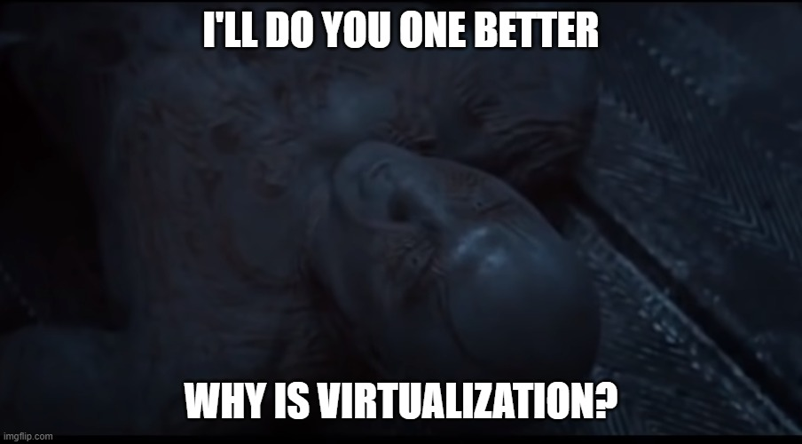
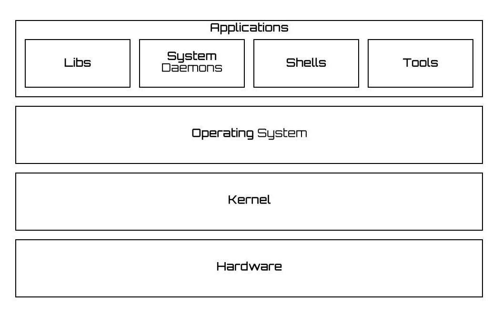
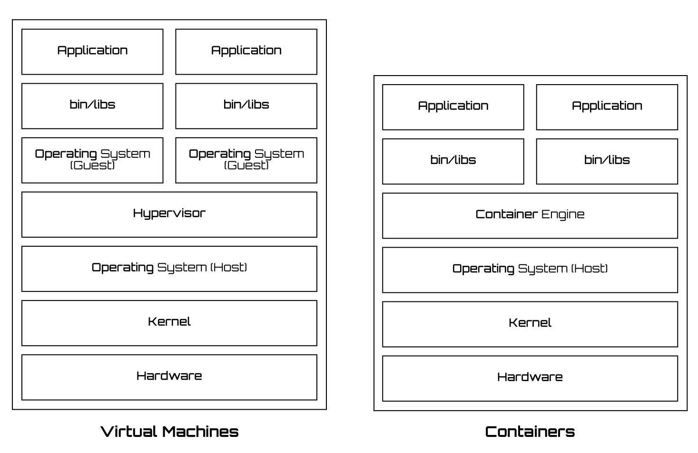

# 🌠 Intro to Virtualization 🔥

  
  
  

### 🤔 SWBAT(s) 
- Why should I care about this? 
- Consumer Hardware vs Server Hardware 
- What, Who & Why is Virtualization?
- Gotcha Terms: Kernel, Hypervisor, Containers

### 🤷🏻‍♀️ Why should I care? 🤷🏻‍♂️

- Because computers && Technology. They ***still*** the future! 👩🏻‍💻
- Better understanding of how cloud works ☁
- At some point, deploying the application may fall on your shoulder 
- Understanding of cutting edge technology that powers modern / cloud based applications

### 🙄 Consumer vs Server Hardware 
- One is meant for consumption 🍽
- The other is meant for production 🍳
- Optimization 
- The difference in cost 💵

---
### 💻 Consumer PCs & Dedicated Servers 

   

---

### ⛅ Cloud Servers & Container Based Solutions

   

---

### ✅ Advantages
- Overall Efficiency
- Scalability On Demand
- Optimization
- **Cost** 💸

<!-- ### Reference Material -->