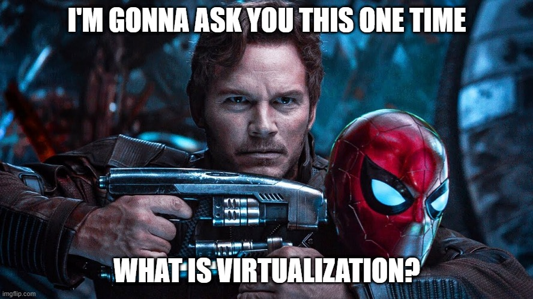
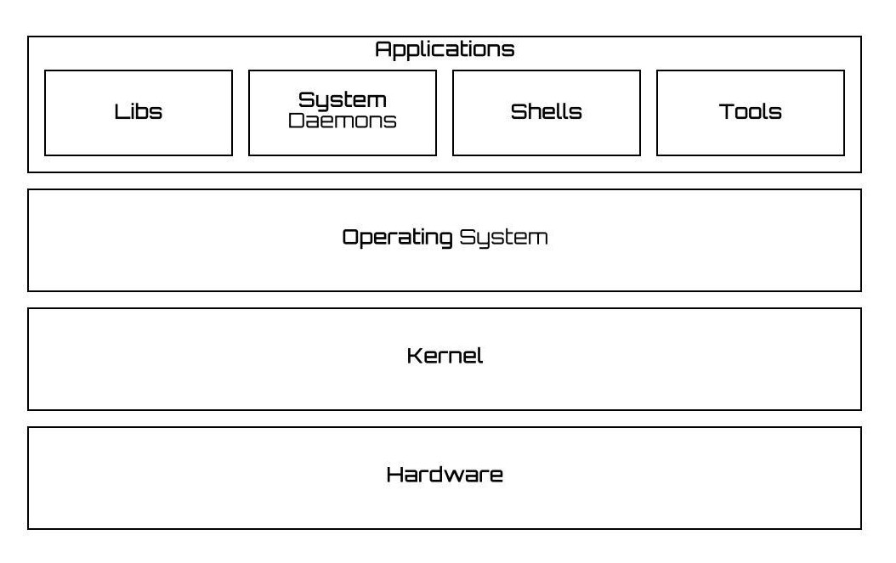
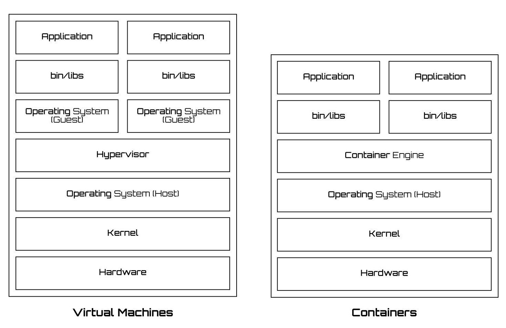

# 🌠 Intro to Virtualization 🔥

  
  
  

### 🤔 SWBAT(s) 
- Why should I care about this? 
- Consumer Hardware vs Server Hardware 
- What, Who & Why is Virtualization?
- Gotcha Terms: Kernel, Hypervisor, Containers

### 🤷🏻‍♀️ Why should I care? 🤷🏻‍♂️

- Because computers && Technology. They ***still*** the future! 👩🏻‍💻
- Better understanding of how cloud works ☁
- At some point, deploying the application(s) may fall on your shoulder 
- Understanding of cutting edge technologies that powers modern / cloud based applications

### 🙄 Consumer vs Server Hardware 
- One is meant for consumption 🍽
- The other is meant for production 🍳
- Optimization 
- The difference in cost 💵

---
### 💻 Consumer PCs & Dedicated Servers 

   

---

### ⛅ Cloud Servers & Container Based Solutions

   

---

### 💲 Pricing (as of May 20th, 2020)

| Host | Type | Range |
| -    | -    | -     |
| AWS | Dedicated | $0.449 - $70.176 + per hour |
| AWS | Virualized | $0.025 - $12 per hour |
| DigitalOcean | Dedicated | - |
| DigitalOcean | Virtualized | $0.007 - $2 per hour  |
| Heroku | Dedicated (vCPUs) | $250 - $550+ per month |
| Heroku | Virtualized | $7 - $50 per month |
| Azure | Dedicated (vCPUs) | $3.819 - $20+ per hour |
| Azure | Virtualized | $0.004 - $40 hour |

** The above prices are just for reference and are subject to change as per configuration.

### ✅ Advantages
- **Cost** 💸
- Overall Efficiency
- Scalability On Demand
- Optimization

<!-- ### Reference Material -->